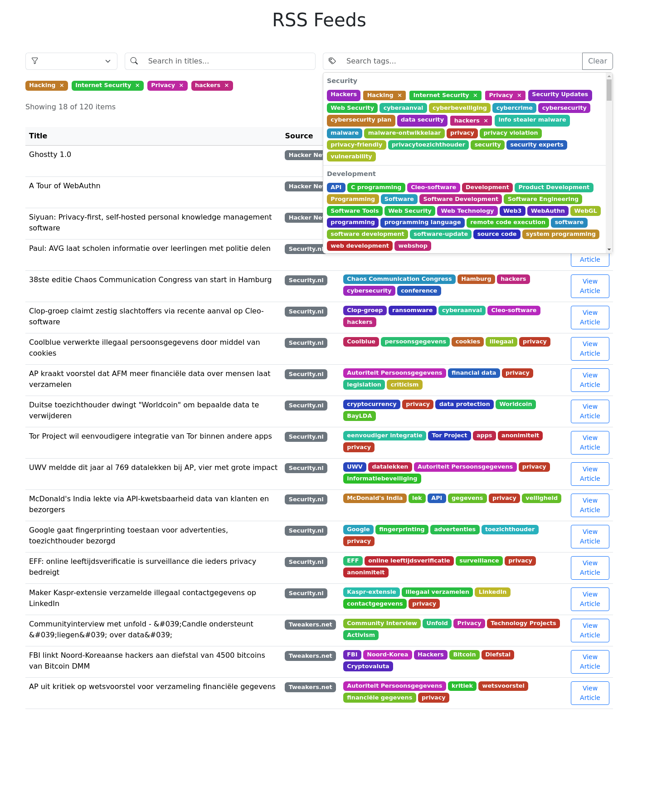

# RSS Feed Reader with AI Tagging

A modern RSS feed reader that automatically tags articles using OpenAI's GPT API. Built with Nuxt.js and Cloudflare Workers.



## Features

- Multiple RSS feed sources (Hacker News, Security.nl, Tweakers.net)
- AI-powered automatic article tagging using OpenAI gpt-4o-mini
- Real-time tag filtering with categorization
- Title search functionality
- Source filtering
- Responsive design with Bootstrap
- Cloudflare KV for caching
- Color-coded tag categories

## Prerequisites

- Node.js (v16 or higher)
- OpenAI API key
- Cloudflare account (free tier works fine)
- Wrangler CLI (`npm install -g wrangler`)

## Local Development Setup

### 1. Clone the repository:
```bash
git clone <repository-url>
cd <repository-name>
```

### 2. Install dependencies:
```bash
npm install
```

### 3. Set up your Cloudflare Worker:

#### a. Login to Cloudflare using Wrangler:
```bash
wrangler login
```

#### b. Create three KV namespaces (for default, dev, and prod environments):
```bash
wrangler kv:namespace create "RSS_CACHE"
wrangler kv:namespace create "RSS_CACHE_DEV"
wrangler kv:namespace create "RSS_CACHE_PROD"
```

Take note of the **namespace IDs** returned from these commands.

### 4. Create a `.dev.vars` file in the root directory with the following variables:
```env
# Development environment variables
OPENAI_API_KEY="your-development-openai-api-key"
CLOUDFLARE_API_TOKEN="your-development-cloudflare-api-token"
CLOUDFLARE_ACCOUNT_ID="your-development-account-id"
RSS_CACHE_KV_ID_DEV="id-from-dev-namespace"
```

This file will store your environment-specific variables for development.

### 5. Update `wrangler.toml` with your KV namespace IDs:
- After obtaining your namespace IDs, update your `wrangler.toml` to include the correct IDs for each environment. Here’s a template for that:

### `wrangler.toml` Configuration

```toml
name = "news-worker"
main = "worker/index.js"
compatibility_date = "2024-01-01"

workers_dev = true

# Default environment (Common for all environments)
kv_namespaces = [
    { binding = "RSS_CACHE", id = "KV_ID" }
]

[vars]
OPENAI_API_KEY = "OPENAI_API_KEY"

# Environment-specific settings
[env]
[env.development]
ENVIRONMENT = "development"
kv_namespaces = [
    { binding = "RSS_CACHE", id = "KV_ID" }
]

[env.production]
ENVIRONMENT = "production"
kv_namespaces = [
    { binding = "RSS_CACHE", id = "KV_ID" }
]
```

Replace `"KV_ID"` with the actual KV namespace IDs for your `default`, `dev`, and `prod` environments.

### 6. Start the development servers:

To run both the Nuxt frontend and Cloudflare Worker simultaneously:
```bash
npm run dev:all
```

Or run them separately in two different terminals:
```bash
# Terminal 1 - Nuxt frontend
npm run dev

# Terminal 2 - Cloudflare Worker
npm run dev:worker
```

The application will be available at `http://localhost:3000`.

## Project Structure

```
├── worker/
│   └── index.js        # Cloudflare Worker code
├── pages/
│   └── index.vue       # Main RSS reader component
├── nuxt.config.ts      # Nuxt configuration
├── wrangler.toml       # Cloudflare Worker configuration
└── .dev.vars           # Environment variables for development
```

## Configuration

### RSS Sources
Currently configured sources are defined in `pages/index.vue`:
- Hacker News (`https://news.ycombinator.com/rss`)
- Security.nl (`https://www.security.nl/rss/headlines.xml`)
- Tweakers.net (`https://tweakers.net/feeds/mixed.xml`)

To add more sources, modify the `sources` array in `pages/index.vue`.

### Tag Categories
Tag categories are defined in `pages/index.vue` under the `TAG_CATEGORIES` constant. Each category contains keywords that are used to automatically group tags.

## Deployment

1. **Deploy the Cloudflare Worker**:
```bash
npm run deploy:worker
```

2. **Deploy the Nuxt frontend to Cloudflare Pages**:
```bash
npm run deploy:pages
```

Or deploy both with a single command:
```bash
npm run deploy
```

## Contributing

1. Fork the repository
2. Create your feature branch (`git checkout -b feature/amazing-feature`)
3. Commit your changes (`git commit -m 'Add some amazing feature'`)
4. Push to the branch (`git push origin feature/amazing-feature`)
5. Open a Pull Request

## License

This project is licensed under the MIT License - see the LICENSE file for details.
